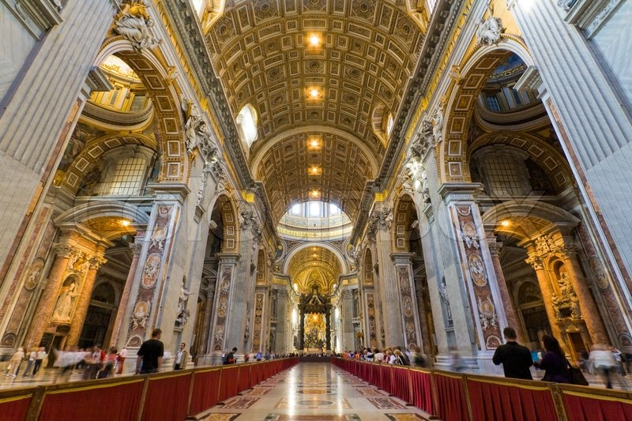
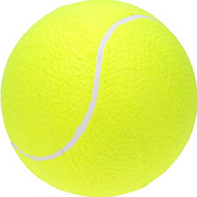
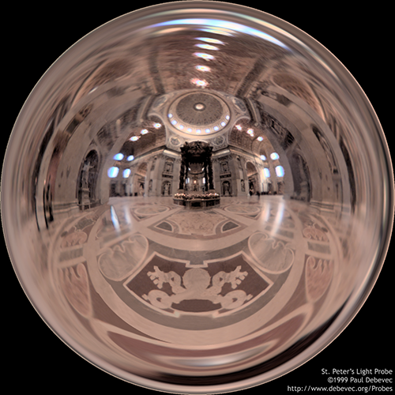
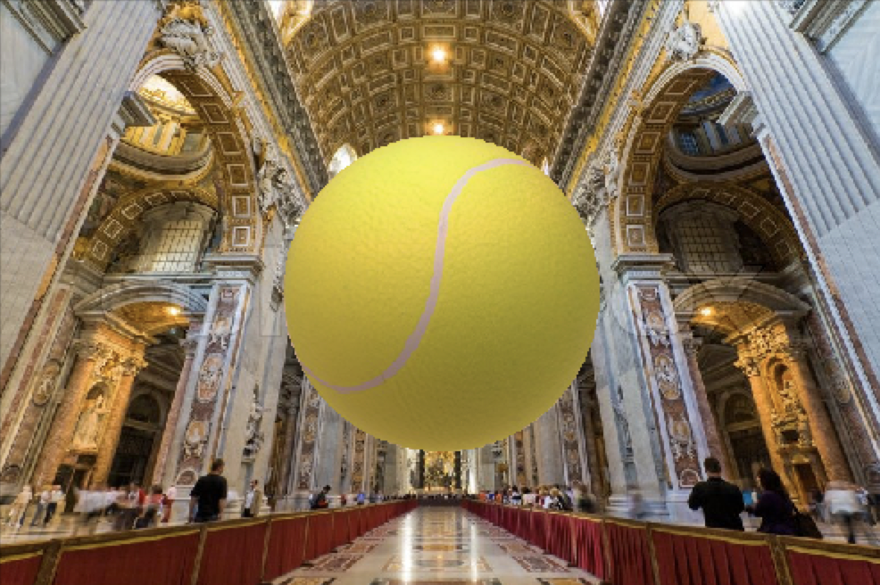

# lighting-approximation
In this project, TLS (Total Least Squares) is used to approximately learn the lighting in a photograph,
which can be used to paste new objects into the image while still maintaining the realism of the image. 
First, the lighting coefficients for the interior of St. Peter’s Basillica are estimated, and then these 
are used to change the lighting of an image of a tennis ball so that it can be pasted into the image of
St. Peter’s Basillica.

| Interior | Tennis Ball | St. Peter's Probe | Result |
| -------- |:-----------:|:-----------------:|:------ |
|  |  |  | 
